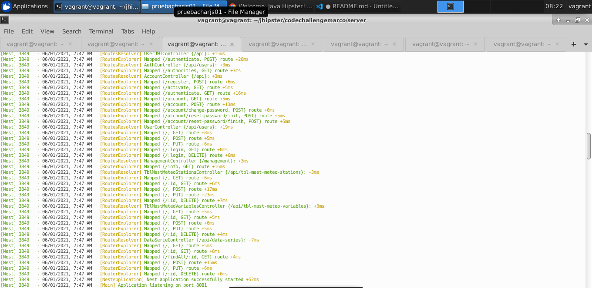
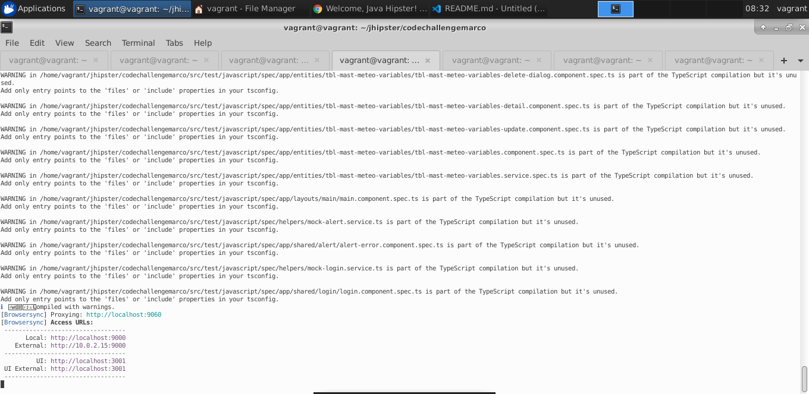
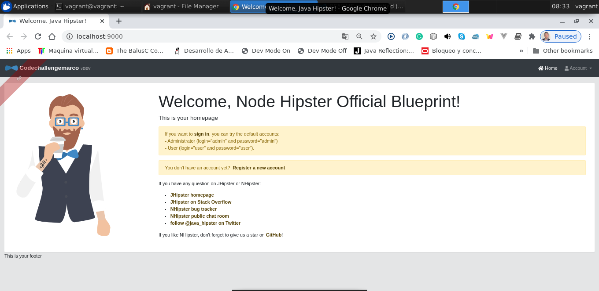
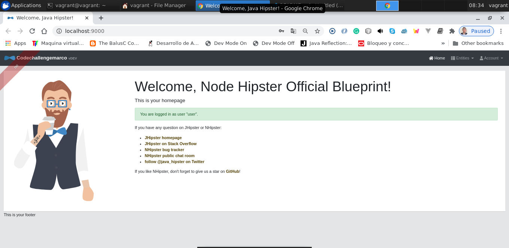
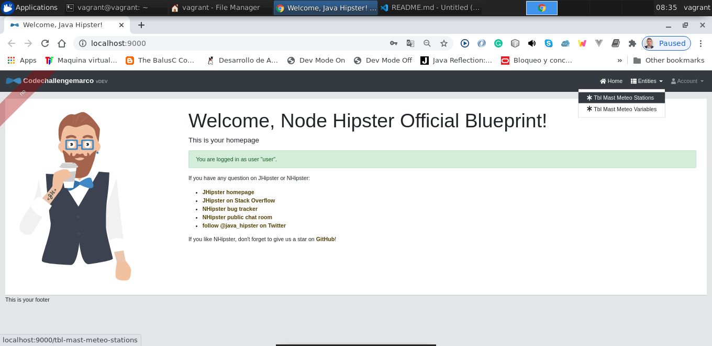
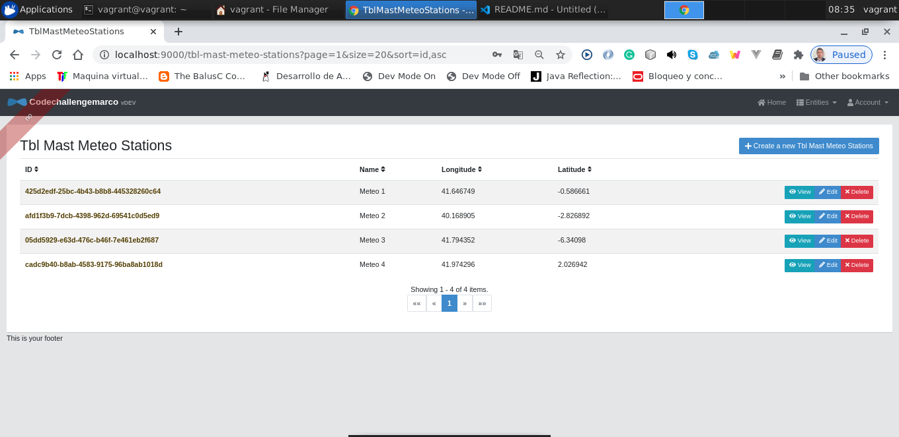
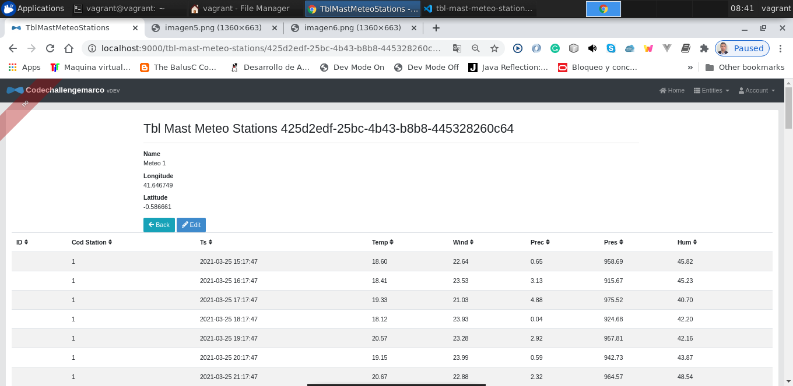

# codechallengemarco

MARCO AURELIO GUADO ZAVALETA  
Barcelona, ESPAÑA - 01 Junio 2021

Entorno desarrollo:  
Linux Ubuntu 18.04  
jadk-11
maven-3.6.3  
nodejs-12.18.4  
npm-6.14.6  
JHipster-6.8.0
PC: 16 GRAM, corei7, 800 GB hard disk

## Development

Iniciamos el proyecto:
cd codechallengemarco/

1. Desplegamos la Base de datos ejecutando un mysql embebido en un docker.  
   cd src/main/docker/  
   docker-compose -f mysql.yml up

2. Nos ubicamos en la raiz del proyecto - codechallengemarco  
   cd server  
   npm install  
   npm start

3. En otra terminal se ubica en el proyecto raiz - codechallengemarco  
   npm install  
   npm start

4. Abrimos el navegador y cargamos la url http://localhost:9000/

5. Realizamos el login con las credenciales: user user

6. En la parte superior derecha, vemos dos puntos de menu que estan relacionada con cada tabla de la BBDD

7. Ingresamos al punto de menu "Tbl Mast Meteo Stations"

8. Si damos click en el boton "view" veremos los datos metereologicos de cada estación, tomamos los ejemplos la estación 1 y 3:

