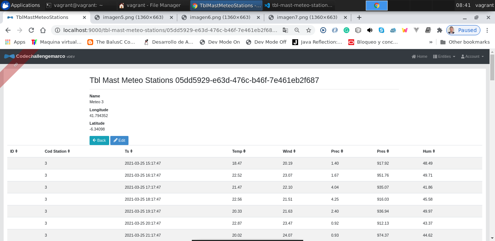

# codechallengemarco

MARCO AURELIO GUADO ZAVALETA  
Barcelona, ESPAÑA - 01 Junio 2021

Entorno desarrollo:  
Linux Ubuntu 18.04  
jadk-11
maven-3.6.3  
nodejs-12.18.4  
npm-6.14.6  
JHipster-6.8.0
PC: 16 GRAM, corei7, 800 GB hard disk

## Development

Iniciamos el proyecto, usando la terminal shell nos ubicamos en la raiz del proyecto:

cd codechallengemarco/

1. Primero iniciamos la Base de datos para ello ejecutamos el fichero mysql.yml

   cd src/main/docker/  
   docker-compose -f mysql.yml up

2. Abrimos otro terminal shell y nos ubicamos en la raiz del proyecto - codechallengemarco
   cd server  
   npm install  
   npm start

3. Abrimos una segunda terminal shell, proyecto raiz - codechallengemarco y ejecutamos los siguientes comandos:
   npm install  
   npm install -g yo@latest  
   npm start

4. Abrimos el navegador y cargamos la url http://localhost:9000/

5. Realizamos el login con las credenciales: user user

6. En la parte superior derecha, vemos dos puntos de menu que estan relacionada con cada tabla de la BBDD

7. Ingresamos al punto de menu "Tbl Mast Meteo Stations"

8. Si damos click en el boton "view" veremos los datos metereologicos de cada estación, tomamos los ejemplos de la estación 1 y 3:

9. Agregamos soporte de grafica instalando chartjs, visualizamos todas las variables:

La grafica se ve con margen en el centro muy distaciando por la diferencia de valores que hay entre Precipitation y Presure.

Si eliminamos estos datos del reporte, la imagen mejora:

Si solo dejamos dos variables la imagen es mejor:

## COMENTARIOS DESARROLLO

El documento que describe el reto, plantea que si se desarrolla con NodeJs seria un plus, bien no he trabajado en proyectos puntuales con node, pero en mi curso de Blockchain Hyperledger Sawtooth use una aplicación desarrollada en NodeJs entonces acepto el reto, hagamos el desarrollo usando NodeJs como backend.

1. Tecnologías; las tecnologías a elegir son: VirtualBox con Linux debian 18.04, como nuestro entorno de desarrollo, las tecnologías a usar serán:

- Mysql
- NodeJs
- Angular
- Docker
- Git
- Vscode

2. De mi experiencia siempre es bueno tener una arquitectura que sea entendible, flexible y que se pueda extender, entonces existe herramientas que te pueden configurar una arquitectura de trabajo, bien esta herramienta es Jhipster que te permite configurar una arquitectura para poder trabajar en ella.

Pero hay que tener un poco de experiencia usando esta herramienta y bueno la tengo porque del saque me fui a utilizar la última versión la 7.0.1 pero al crear las entidades en el Back con Mysql me daba error, teniendo pocos días para investigar porque el error, he ido a la versión que más conozco, que es la Jhipster 6.8.0

La versión Jhipster 6.8.0 trabaja con Angular punto 9 con lo cual al momento de instalar la librería chartjs también daba problema porque siempre se instala la última versión, así que uno va buscando la versión de chartjs que sea compatible con el Angular 9

Se instala en package.json la versión a utilizar:  
…  
 "@types/chart.js": "^2.9.32",  
 "chart.js": "^2.9.3"  
…

3. Al invocar una API externa para traer los datos, he preferido hacer la llamada desde el Backend así me evito configurar en el front la seguridad de tipo CROSS

4. Todo el trabajo esta concentrado en estos tres archivos:  
   BACKEND  
   ../codechallengemarco/server/src/web/rest/data-serie.controller.ts  
   FRONTEND  
   ../codechallengemarco/src/main/webapp/app/entities/tbl-mast-meteo-stations/tbl-
   mast-meteo-stations-detail.component.html  
   ../codechallengemarco/src/main/webapp/app/entities/tbl-mast-meteo-stations/tbl-mast-meteo-stations-detail.component.ts

5. En el BACKEND el servicio REST data-serie.controller.ts es para poder gestionar la API que hace la llamada a https://demo3679421.mockable.io/meteo

6. En el FRONT en el fichero html, tiene tres partes, la parte superior que visualiza los datos de la estación, la parte central que muestra una grafica y la parte inferior que son todos los datos que corresponde a esa estación.

7. El fichero ts es el que implementa la lógica, al ver el detalle de una estación, filtra los datos correspondientes a esa estación para después mostrarlo en una tabla y en la gráfica.

